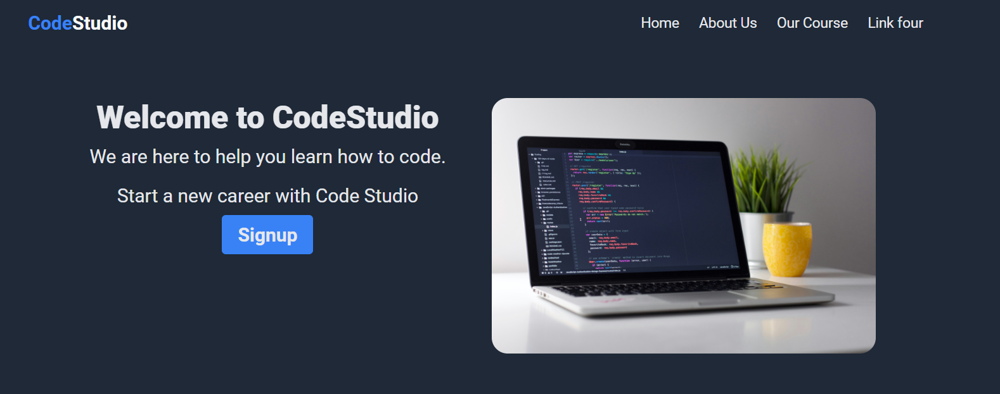
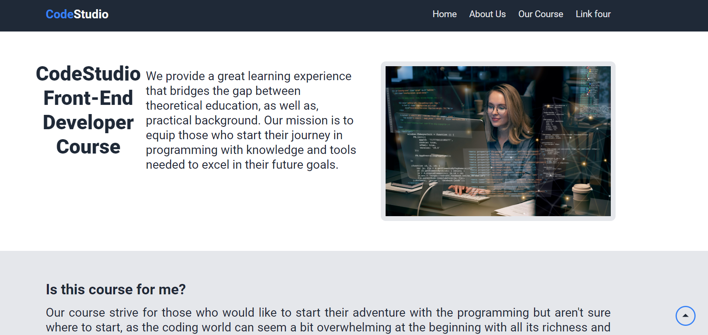

# KreativStorm-project1

## Table of contents

- [Overview](#overview)
  - [The Project](#the-project)
  - [Screenshot](#screenshot)
  - [Links](#links)
  - [Screenshots](#screenshots) 
  - [Built with](#built-with)
  - [What we learned](#what-we-learned)
  - [Continued development](#continued-development)
  - [Useful resources](#useful-resources)
- [Authors](#authors)
- [Acknowledgments](#acknowledgments)

## Overview

### The Project
We created a simple landing page for a Coding School company called CodeStudio. The page is fully responsive and was built using HTML and CSS.

### Links

- Solution URL: [Add solution URL here](https://github.com/basiacarvalho/kreativstorm-project1)
- Live Site URL: [Add live site URL here](https://basiacarvalho.github.io/kreativstorm-project1/)

### Screenshots
Computer view :




### Built with
- Semantic HTML5 markup
- CSS custom properties
- Flexbox
- CSS Grid
- Mobile-first workflow

### What we learned
We learned how to create a simple landing page using HTML and CSS. We also learned how to make the page responsive using media queries. Some of the things we learned include:
- Flexbox
- CSS Grid
- Media queries
- Responsive design


Some code snippets :

```html
<p class="quote-block__text">
 Tell me and I forget, teach me and I may remember, involve me and
 I learn.
 </p>
```

```css
 .scroll-to-top {
  position: fixed;
  bottom: 0;
  right: 0;
  z-index: 1;
  width: 40px;
  height: 40px;
  text-align: center;
  background-color: var(--background-color-light);
  border: 3px solid var(--active-color);
  border-radius: 50px;
  margin: 0 15px 15px 0;
  padding: 4px 0;
  transition: background-color 0.3s;
}
 
```

### Useful resources

- [Example resource 1](https://www.w3schools.com/css/css3_flexbox.asp) - This helped us understand how to use flexbox. I really liked this pattern and will use it going forward.
- [Example resource 2](https://www.w3schools.com/css/css_rwd_mediaqueries.asp) - This is an amazing article which helped us finally understand media queries. I'd recommend it to anyone still learning this concept.
- [Example resource 3](https://www.w3schools.com/css/css_grid.asp) - This is an amazing article which helped us finally understand CSS Grid. I'd recommend it to anyone still learning this concept.

### Continued development

We would like to continue learning about responsive design and how to make our pages more interactive. We would also like to learn more about JavaScript and how to use it to make our pages more interactive. 


## Authors
 

## Acknowledgments

This is where you can give a hat tip to anyone who helped you out on this project. Perhaps you worked in a team or got some inspiration from someone else's solution. This is the perfect place to give them some credit.
